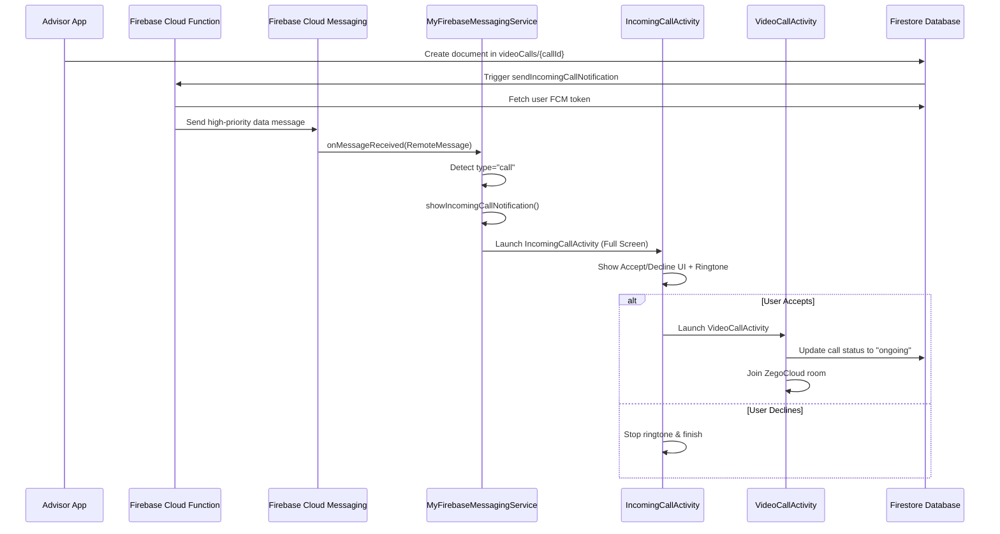

# Call Notification Implementation Guide

## Overview

This guide documents the complete implementation flow for incoming video call notifications in the Associate Android app. The system receives call notifications from Firebase Cloud Functions and displays them to users with Accept/Cancel actions.

---

## Architecture Flow



---

## Component Breakdown

### 1. Firebase Cloud Function

**File**: `firebase_functions/index.js`

**Function**: `sendIncomingCallNotification`

**Trigger**: Document created in `videoCalls/{callId}`

**Key Features**:
- Fetches user's FCM token from `users` collection
- Sends **data-only message** (no notification payload) for background wake-up
- High priority with TTL=0 for immediate delivery

**Payload Structure**:
```javascript
{
  token: fcmToken,
  data: {
    type: "call",
    callId: callId,
    channelName: channelName,
    title: callerName,
    click_action: "FLUTTER_NOTIFICATION_CLICK"
  },
  android: {
    priority: "high",
    ttl: 0
  }
}
```

---

### 2. FCM Service

**File**: [`MyFirebaseMessagingService.kt`](file:///c:/Users/asus/StudioProjects/Associate/app/src/main/java/com/example/associate/NotificationFCM/MyFirebaseMessagingService.kt)

**Purpose**: Receives FCM messages and routes them based on type

**Key Methods**:

#### `onMessageReceived(message: RemoteMessage)`
- Checks if `data["type"] == "call"` or contains `callId`
- Routes to `showIncomingCallNotification()` for call notifications
- Handles other notification types separately

#### `showIncomingCallNotification(data: Map<String, String>)`
- Extracts call data: `callId`, `channelName`, `callerName`
- Creates notification with:
  - **Full screen intent** to launch `IncomingCallActivity`
  - **Accept action** → Opens `VideoCallActivity` directly
  - **Decline action** → Opens `IncomingCallActivity` with `ACTION_DECLINE`
  - **Ongoing notification** (stays until answered)
  - **High priority** with CATEGORY_CALL

**Current Implementation**:
```kotlin
private fun showIncomingCallNotification(data: Map<String, String>) {
    val callId = data["callId"] ?: ""
    val channelName = data["channelName"] ?: ""
    val callerName = data["title"] ?: "Incoming Call"
    
    // Full screen intent for incoming call screen
    val intent = Intent(this, IncomingCallActivity::class.java).apply {
        flags = Intent.FLAG_ACTIVITY_NEW_TASK or Intent.FLAG_ACTIVITY_CLEAR_TOP
        putExtra("CALL_ID", callId)
        putExtra("CHANNEL_NAME", channelName)
        putExtra("title", callerName)
    }
    
    val pendingIntent = PendingIntent.getActivity(
        this, callId.hashCode(), intent,
        PendingIntent.FLAG_UPDATE_CURRENT or PendingIntent.FLAG_IMMUTABLE
    )
    
    val notificationBuilder = NotificationCompat.Builder(this, CHANNEL_ID)
        .setSmallIcon(R.drawable.notification)
        .setContentTitle(callerName)
        .setContentText("Incoming Video Call")
        .setPriority(NotificationCompat.PRIORITY_HIGH)
        .setCategory(NotificationCompat.CATEGORY_CALL)
        .setAutoCancel(true)
        .setFullScreenIntent(pendingIntent, true)
        .setVisibility(NotificationCompat.VISIBILITY_PUBLIC)
        .setOngoing(true)
        
    // Add notification actions
    notificationBuilder.addAction(android.R.drawable.ic_menu_call, "Accept", acceptPendingIntent)
    notificationBuilder.addAction(android.R.drawable.ic_menu_close_clear_cancel, "Decline", declinePendingIntent)
        
    notificationManager.notify(callId.hashCode(), notificationBuilder.build())
}
```

---

### 3. Incoming Call Activity

**File**: [`IncomingCallActivity.kt`](file:///c:/Users/asus/StudioProjects/Associate/app/src/main/java/com/example/associate/Activitys/IncomingCallActivity.kt)

**Purpose**: Full-screen incoming call UI with Accept/Decline buttons

**Key Features**:
- **Shows over lock screen** using `setShowWhenLocked(true)` and `setTurnScreenOn(true)`
- **Plays ringtone** until user responds
- **Accept button** → Launches `VideoCallActivity` with call data
- **Decline button** → Stops ringtone and finishes activity
- **Handles ACTION_DECLINE** from notification action

**Implementation Highlights**:
```kotlin
override fun onCreate(savedInstanceState: Bundle?) {
    super.onCreate(savedInstanceState)
    
    // Wake up screen and show over lock screen
    if (Build.VERSION.SDK_INT >= Build.VERSION_CODES.O_MR1) {
        setShowWhenLocked(true)
        setTurnScreenOn(true)
        val keyguardManager = getSystemService(Context.KEYGUARD_SERVICE) as? KeyguardManager
        keyguardManager?.requestDismissKeyguard(this, null)
    }
    
    // Handle decline action from notification
    if (intent?.action == "ACTION_DECLINE") {
        stopRingtone()
        finish()
        return
    }
    
    // Get call details
    val callId = intent.getStringExtra("CALL_ID") ?: ""
    val channelName = intent.getStringExtra("CHANNEL_NAME") ?: ""
    val callerName = intent.getStringExtra("title") ?: "Unknown Caller"
    
    playRingtone()
    
    binding.btnAccept.setOnClickListener {
        stopRingtone()
        acceptCall(callId, channelName)
    }
}

private fun acceptCall(callId: String, channelName: String) {
    val intent = Intent(this, VideoCallActivity::class.java).apply {
        putExtra("CALL_ID", callId)
        putExtra("CHANNEL_NAME", channelName)
    }
    startActivity(intent)
    finish()
}
```

---

### 4. Video Call Activity

**File**: [`VideoCallActivity.kt`](file:///c:/Users/asus/StudioProjects/Associate/app/src/main/java/com/example/associate/Activitys/VideoCallActivity.kt)

**Purpose**: Manages the actual video call using ZegoCloud SDK

**Key Responsibilities**:
1. **Initialize ZegoCloud** with App ID and App Sign
2. **Join room** using the `channelName` from intent
3. **Update Firestore** call status to "ongoing"
4. **Start payment service** for call billing
5. **Handle call controls** (mute, video toggle, camera switch)
6. **Monitor call duration** and calculate costs
7. **End call** and update Firestore with duration

**Call Flow**:
```kotlin
override fun onCreate(savedInstanceState: Bundle?) {
    super.onCreate(savedInstanceState)
    
    currentCallId = intent.getStringExtra("CALL_ID") ?: ""
    
    checkPermissionsAndInitialize()
    setupCallControls()
    registerBroadcastReceiver()
}

private fun initializeZego() {
    zegoManager = ZegoCallManager(this, this)
    zegoManager.initializeEngine(AppConstants.ZEGO_APP_ID, AppConstants.ZEGO_APP_SIGN)
    
    // Setup local video
    val localTextureView = TextureView(this)
    binding.localVideoView.addView(localTextureView)
    zegoManager.setupLocalVideo(localTextureView)
    
    // Join room
    val roomID = intent.getStringExtra("CHANNEL_NAME") ?: AppConstants.DEFAULT_CHANNEL_NAME
    zegoManager.joinRoom(roomID, localUserID, localUserName)
    
    // Update call status
    updateCallStatusInFirestore("ongoing")
    
    // Start billing
    isCallActive = true
    callStartTime = System.currentTimeMillis()
    startCallTimer()
    startPaymentService()
}
```

---

### 5. Android Manifest Configuration

**File**: [`AndroidManifest.xml`](file:///c:/Users/asus/StudioProjects/Associate/app/src/main/AndroidManifest.xml)

**Required Permissions**:
```xml
<uses-permission android:name="android.permission.CAMERA" />
<uses-permission android:name="android.permission.RECORD_AUDIO" />
<uses-permission android:name="android.permission.INTERNET" />
<uses-permission android:name="android.permission.POST_NOTIFICATIONS" />
<uses-permission android:name="android.permission.USE_FULL_SCREEN_INTENT" />
<uses-permission android:name="android.permission.SYSTEM_ALERT_WINDOW" />
<uses-permission android:name="android.permission.WAKE_LOCK" />
<uses-permission android:name="android.permission.DISABLE_KEYGUARD" />
<uses-permission android:name="android.permission.FOREGROUND_SERVICE" />
```

**Service Registration**:
```xml
<!-- Firebase Cloud Messaging Service -->
<service
    android:name=".NotificationFCM.MyFirebaseMessagingService"
    android:exported="false">
    <intent-filter>
        <action android:name="com.google.firebase.MESSAGING_EVENT" />
    </intent-filter>
</service>

<!-- Video Call Service -->
<service
    android:name=".Repositorys.VideoCallService"
    android:enabled="true"
    android:exported="false"
    android:foregroundServiceType="mediaProjection" />
```

**Activity Configuration**:
```xml
<!-- Incoming Call Activity -->
<activity
    android:name=".Activitys.IncomingCallActivity"
    android:screenOrientation="portrait"
    android:exported="false"
    android:showWhenLocked="true"
    android:turnScreenOn="true"
    android:launchMode="singleTop"
    android:theme="@style/Theme.AppCompat.NoActionBar" />

<!-- Video Call Activity -->
<activity
    android:name=".Activitys.VideoCallActivity"
    android:screenOrientation="portrait"
    android:theme="@style/Theme.AppCompat.NoActionBar"
    android:exported="false"
    android:configChanges="orientation|screenSize|keyboardHidden"
    android:hardwareAccelerated="true" />
```

**Default Notification Channel**:
```xml
<meta-data
    android:name="com.google.firebase.messaging.default_notification_channel_id"
    android:value="user_calls_channel" />
```

---

## Optimization: BroadcastReceiver for Notification Actions

### Current Limitation

The current implementation uses `PendingIntent.getActivity()` for notification actions, which:
- Opens activities even when user just wants to decline
- Doesn't allow background processing without UI
- Can't update Firestore status before showing UI

### Recommended Approach: CallActionReceiver

Create a `BroadcastReceiver` to handle Accept/Cancel actions more efficiently.

#### Step 1: Create CallActionReceiver.kt

```kotlin
package com.example.associate.Receivers

import android.content.BroadcastReceiver
import android.content.Context
import android.content.Intent
import android.util.Log
import androidx.core.app.NotificationManagerCompat
import com.example.associate.Activitys.VideoCallActivity
import com.google.firebase.Timestamp
import com.google.firebase.firestore.FirebaseFirestore

class CallActionReceiver : BroadcastReceiver() {

    companion object {
        const val ACTION_ACCEPT_CALL = "com.example.associate.ACTION_ACCEPT_CALL"
        const val ACTION_DECLINE_CALL = "com.example.associate.ACTION_DECLINE_CALL"
        const val EXTRA_CALL_ID = "CALL_ID"
        const val EXTRA_CHANNEL_NAME = "CHANNEL_NAME"
        const val EXTRA_CALLER_NAME = "CALLER_NAME"
        const val EXTRA_NOTIFICATION_ID = "NOTIFICATION_ID"
    }

    override fun onReceive(context: Context, intent: Intent) {
        val callId = intent.getStringExtra(EXTRA_CALL_ID) ?: return
        val channelName = intent.getStringExtra(EXTRA_CHANNEL_NAME) ?: ""
        val notificationId = intent.getIntExtra(EXTRA_NOTIFICATION_ID, 0)

        // Dismiss notification
        val notificationManager = NotificationManagerCompat.from(context)
        notificationManager.cancel(notificationId)

        when (intent.action) {
            ACTION_ACCEPT_CALL -> {
                Log.d("CallActionReceiver", "User accepted call: $callId")
                
                // Update Firestore status to accepted
                updateCallStatus(callId, "accepted")
                
                // Launch VideoCallActivity
                val videoIntent = Intent(context, VideoCallActivity::class.java).apply {
                    putExtra(EXTRA_CALL_ID, callId)
                    putExtra(EXTRA_CHANNEL_NAME, channelName)
                    flags = Intent.FLAG_ACTIVITY_NEW_TASK or Intent.FLAG_ACTIVITY_CLEAR_TOP
                }
                context.startActivity(videoIntent)
            }
            
            ACTION_DECLINE_CALL -> {
                Log.d("CallActionReceiver", "User declined call: $callId")
                
                // Update Firestore status to rejected
                updateCallStatus(callId, "rejected")
            }
        }
    }

    private fun updateCallStatus(callId: String, status: String) {
        val db = FirebaseFirestore.getInstance()
        val updates = hashMapOf<String, Any>(
            "status" to status,
            "lastUpdated" to Timestamp.now()
        )

        db.collection("videoCalls")
            .document(callId)
            .update(updates)
            .addOnSuccessListener {
                Log.d("CallActionReceiver", "Call status updated to: $status")
            }
            .addOnFailureListener { e ->
                Log.e("CallActionReceiver", "Failed to update call status: ${e.message}")
            }
    }
}
```

#### Step 2: Update MyFirebaseMessagingService.kt

Replace the notification action PendingIntents with BroadcastReceiver intents:

```kotlin
private fun showIncomingCallNotification(data: Map<String, String>) {
    val notificationManager = getSystemService(Context.NOTIFICATION_SERVICE) as NotificationManager
    val callId = data["callId"] ?: ""
    val channelName = data["channelName"] ?: ""
    val callerName = data["title"] ?: "Incoming Call"
    val notificationId = callId.hashCode()
    
    // Full screen intent for incoming call screen
    val fullScreenIntent = Intent(this, IncomingCallActivity::class.java).apply {
        flags = Intent.FLAG_ACTIVITY_NEW_TASK or Intent.FLAG_ACTIVITY_CLEAR_TOP
        putExtra("CALL_ID", callId)
        putExtra("CHANNEL_NAME", channelName)
        putExtra("title", callerName)
    }
    
    val fullScreenPendingIntent = PendingIntent.getActivity(
        this, notificationId, fullScreenIntent,
        PendingIntent.FLAG_UPDATE_CURRENT or PendingIntent.FLAG_IMMUTABLE
    )
    
    // Accept action using BroadcastReceiver
    val acceptIntent = Intent(this, CallActionReceiver::class.java).apply {
        action = CallActionReceiver.ACTION_ACCEPT_CALL
        putExtra(CallActionReceiver.EXTRA_CALL_ID, callId)
        putExtra(CallActionReceiver.EXTRA_CHANNEL_NAME, channelName)
        putExtra(CallActionReceiver.EXTRA_CALLER_NAME, callerName)
        putExtra(CallActionReceiver.EXTRA_NOTIFICATION_ID, notificationId)
    }
    val acceptPendingIntent = PendingIntent.getBroadcast(
        this, notificationId + 1, acceptIntent,
        PendingIntent.FLAG_UPDATE_CURRENT or PendingIntent.FLAG_IMMUTABLE
    )

    // Decline action using BroadcastReceiver
    val declineIntent = Intent(this, CallActionReceiver::class.java).apply {
        action = CallActionReceiver.ACTION_DECLINE_CALL
        putExtra(CallActionReceiver.EXTRA_CALL_ID, callId)
        putExtra(CallActionReceiver.EXTRA_NOTIFICATION_ID, notificationId)
    }
    val declinePendingIntent = PendingIntent.getBroadcast(
        this, notificationId + 2, declineIntent,
        PendingIntent.FLAG_UPDATE_CURRENT or PendingIntent.FLAG_IMMUTABLE
    )
    
    val notificationBuilder = NotificationCompat.Builder(this, CHANNEL_ID)
        .setSmallIcon(R.drawable.notification)
        .setContentTitle(callerName)
        .setContentText("Incoming Video Call")
        .setPriority(NotificationCompat.PRIORITY_HIGH)
        .setCategory(NotificationCompat.CATEGORY_CALL)
        .setAutoCancel(true)
        .setFullScreenIntent(fullScreenPendingIntent, true)
        .setVisibility(NotificationCompat.VISIBILITY_PUBLIC)
        .setOngoing(true)
        .addAction(android.R.drawable.ic_menu_call, "Accept", acceptPendingIntent)
        .addAction(android.R.drawable.ic_menu_close_clear_cancel, "Decline", declinePendingIntent)
        
    notificationManager.notify(notificationId, notificationBuilder.build())
    Log.d(TAG, "Incoming call notification displayed with BroadcastReceiver actions")
}
```

#### Step 3: Register BroadcastReceiver in AndroidManifest.xml

Add inside the `<application>` tag:

```xml
<!-- Call Action Broadcast Receiver -->
<receiver
    android:name=".Receivers.CallActionReceiver"
    android:exported="false">
    <intent-filter>
        <action android:name="com.example.associate.ACTION_ACCEPT_CALL" />
        <action android:name="com.example.associate.ACTION_DECLINE_CALL" />
    </intent-filter>
</receiver>
```

### Benefits of BroadcastReceiver Approach

✅ **Cleaner separation of concerns** - Notification actions handled separately from UI  
✅ **Firestore updates before UI** - Status updated to "accepted"/"rejected" immediately  
✅ **No unnecessary activity launches** - Decline doesn't open any activity  
✅ **Better notification management** - Notification dismissed automatically  
✅ **Advisor-side awareness** - Advisor app can listen to call status changes in real-time

---

## Testing Checklist

### Prerequisites
- [ ] Firebase Cloud Functions deployed successfully
- [ ] User has valid FCM token saved in Firestore
- [ ] App has all required permissions granted
- [ ] ZegoCloud credentials configured correctly

### Test Scenarios

#### 1. Background Call Reception
- [ ] Close the app completely
- [ ] Advisor initiates a call
- [ ] Verify notification appears with Accept/Cancel buttons
- [ ] Verify full-screen intent launches `IncomingCallActivity`
- [ ] Verify ringtone plays

#### 2. Foreground Call Reception
- [ ] Keep app open
- [ ] Advisor initiates a call
- [ ] Verify notification appears
- [ ] Verify `IncomingCallActivity` launches

#### 3. Lock Screen Call Reception
- [ ] Lock the device
- [ ] Advisor initiates a call
- [ ] Verify screen wakes up
- [ ] Verify call UI shows over lock screen
- [ ] Verify ringtone plays

#### 4. Accept Call Flow
- [ ] Tap "Accept" button
- [ ] Verify ringtone stops
- [ ] Verify `VideoCallActivity` launches
- [ ] Verify call status updates to "ongoing" in Firestore
- [ ] Verify local video appears
- [ ] Verify remote video appears when advisor joins
- [ ] Verify call timer starts
- [ ] Verify payment service starts

#### 5. Decline Call Flow
- [ ] Tap "Decline" button
- [ ] Verify ringtone stops
- [ ] Verify notification dismissed
- [ ] Verify call status updates to "rejected" in Firestore (if using BroadcastReceiver)
- [ ] Verify no activity remains open

#### 6. Notification Action - Accept
- [ ] Tap "Accept" from notification (not full screen)
- [ ] Verify same behavior as Accept button in activity

#### 7. Notification Action - Decline
- [ ] Tap "Decline" from notification
- [ ] Verify notification dismissed
- [ ] Verify no activity opens

#### 8. Call Controls
- [ ] Accept a call
- [ ] Test mute/unmute microphone
- [ ] Test enable/disable video
- [ ] Test switch camera
- [ ] Test end call button

#### 9. Payment Integration
- [ ] Accept a call
- [ ] Verify payment service starts
- [ ] Verify call timer updates every second
- [ ] Verify payment info shows rate and spent amount
- [ ] Let call run for 1 minute
- [ ] Verify amount deducted correctly

#### 10. Insufficient Balance
- [ ] Set user balance to low amount
- [ ] Accept a call
- [ ] Wait for balance to run out
- [ ] Verify "Insufficient Balance" dialog appears
- [ ] Verify call ends automatically

---

## Firestore Data Structure

### videoCalls Collection

```javascript
{
  callId: "auto-generated-id",
  callerId: "advisor-uid",
  callerName: "Dr. John Doe",
  receiverId: "user-uid",
  channelName: "call_12345_67890",
  status: "pending" | "accepted" | "rejected" | "ongoing" | "ended",
  createdAt: Timestamp,
  callStartTime: Timestamp,
  callEndTime: Timestamp,
  duration: 120, // seconds
  lastUpdated: Timestamp
}
```

### users Collection

```javascript
{
  uid: "user-uid",
  name: "User Name",
  email: "user@example.com",
  fcmToken: "fcm-token-string",
  walletBalance: 500.00,
  // ... other user fields
}
```

---

## Troubleshooting

### Notification Not Appearing

**Possible Causes**:
1. FCM token not saved in Firestore
2. Notification channel not created
3. App doesn't have notification permission
4. High priority not set in FCM payload

**Solutions**:
- Check Logcat for FCM token logs
- Verify `createNotificationChannel()` is called
- Request `POST_NOTIFICATIONS` permission on Android 13+
- Ensure Cloud Function sends `priority: "high"`

### Full Screen Intent Not Working

**Possible Causes**:
1. Missing `USE_FULL_SCREEN_INTENT` permission
2. Battery optimization blocking the app
3. DND (Do Not Disturb) mode enabled

**Solutions**:
- Add permission to manifest
- Disable battery optimization for the app
- Set notification category to `CATEGORY_CALL`

### Video Not Showing

**Possible Causes**:
1. Camera permission not granted
2. ZegoCloud initialization failed
3. Incorrect channel name
4. Network issues

**Solutions**:
- Check camera permissions
- Verify ZegoCloud App ID and App Sign
- Ensure both users join the same `channelName`
- Check internet connection

### Call Status Not Updating

**Possible Causes**:
1. Firestore rules blocking writes
2. Incorrect document path
3. Network issues

**Solutions**:
- Check Firestore security rules
- Verify `callId` is correct
- Check Logcat for Firestore errors

---

## Summary

Your current implementation is **well-structured and functional**. The key components are:

1. ✅ **Firebase Cloud Function** sends high-priority data messages
2. ✅ **FCM Service** routes notifications based on type
3. ✅ **IncomingCallActivity** provides full-screen call UI with ringtone
4. ✅ **VideoCallActivity** handles the actual video call with ZegoCloud
5. ✅ **AndroidManifest** properly configured with permissions and services

### Optional Enhancement

Consider implementing the **BroadcastReceiver approach** for notification actions to:
- Update Firestore status immediately when user accepts/declines
- Avoid opening activities for decline actions
- Provide better separation of concerns

Both approaches work, but the BroadcastReceiver pattern is more scalable and provides better user experience.

<!-- Updated for repository activity -->
